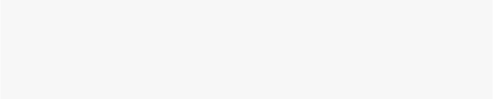

checked
================

<!-- README.md is generated from README.Rmd. Please edit that file -->

> Batch `R CMD check` management

<!-- badges: start -->

[](https://github.com/maksymiuks/checked/actions/workflows/R-CMD-check.yaml/badge.svg)
[](https://cran.r-project.org/package=checked)
[](https://app.codecov.io/gh/maksymiuks/checked?branch=main)
<!-- badges: end -->

# Reverse-dependency Checks

``` r
library(checked)
run("/home/dev/praise")
```

<picture>
<source media="(prefers-color-scheme: dark)" srcset="man/figures/README/ansi-tty-example-dark.svg">

</picture>
